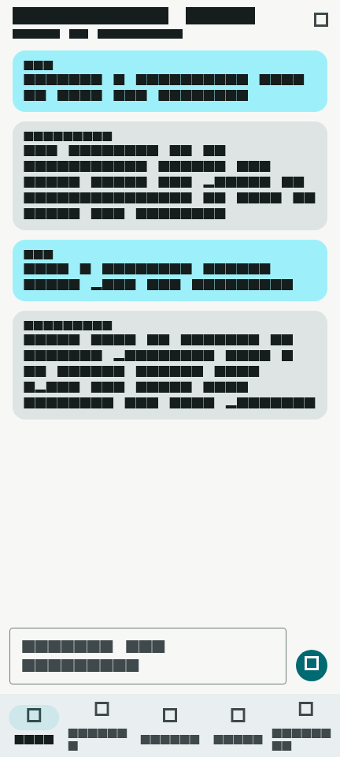
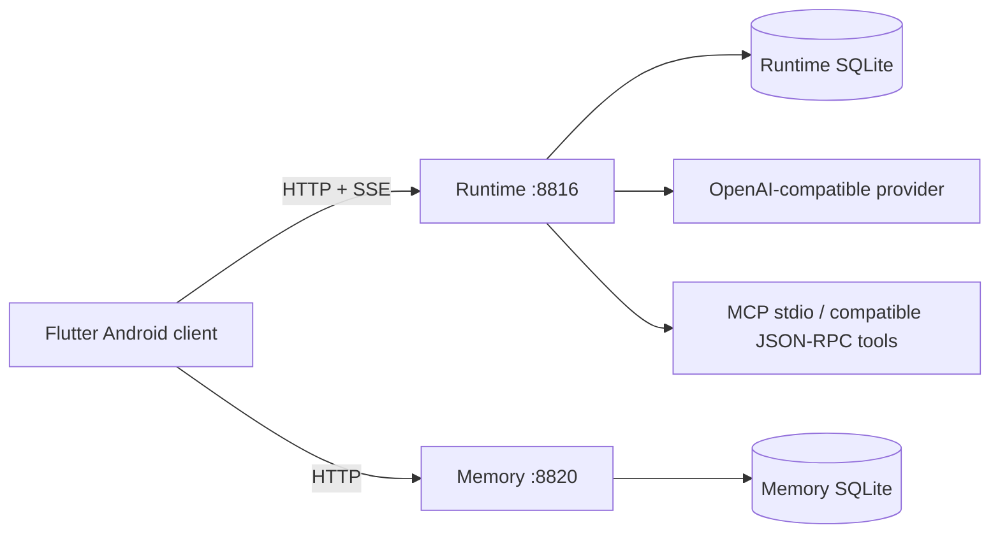
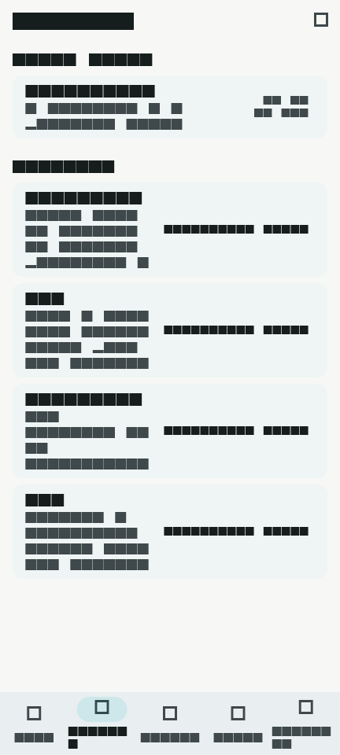
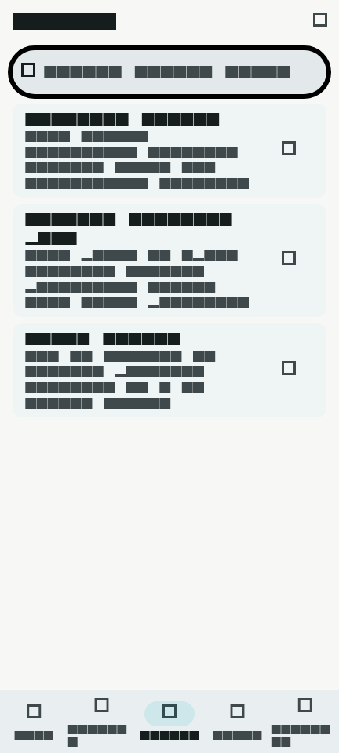
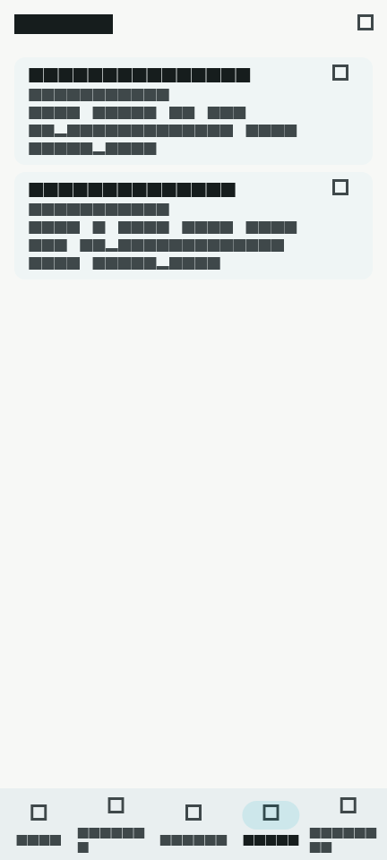
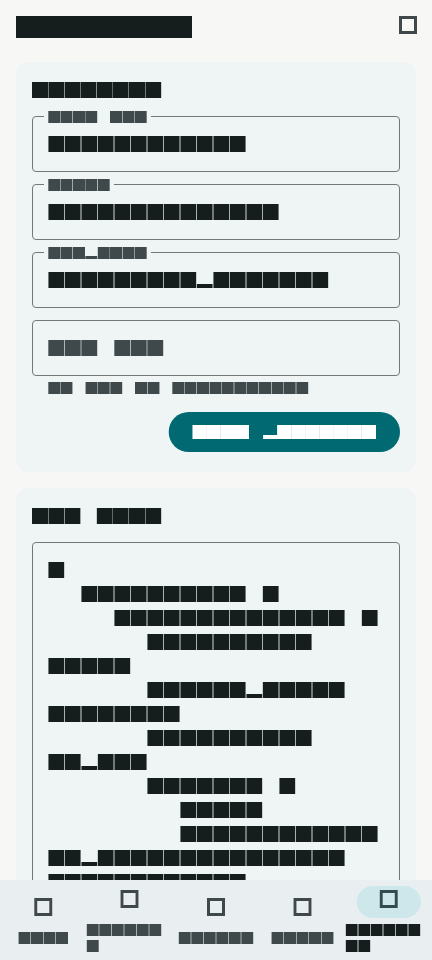

# Continuum Chat

**简体中文** | [English](README_EN.md)

Continuum Chat 是一个基于 **Flutter、FastAPI 与 SQLite** 的自托管 Android AI 对话参考实现。它支持 OpenAI-compatible 流式响应、服务端 canonical 会话历史、显式 Context Epoch、独立 Memory 服务、手动 MCP 工具发现/调用，以及 Provider Token 使用统计。默认提供本地 Mock Provider，**无需 API Key 即可跑通核心流程**。

<p align="center">
  
</p>

### 核心能力

- Streaming AI Chat：SSE 流式响应，支持可选 reasoning 事件
- Server-owned canonical history：会话历史由 Runtime 持久化
- Context Epoch：显式切换后续 Provider 上下文边界，不删除旧历史
- Memory service：独立 Memory CRUD / recall 服务
- MCP tools：手动 stdio 工具发现 / 调用，另有基础 JSON-RPC-over-HTTP 适配
- Provider usage analytics：按日汇总 Provider input/output Token

**技术栈：** Flutter · FastAPI · SQLite · Python · Dart

[](https://github.com/yuyu1838309000-cmd/continuum-chat/actions/workflows/ci.yml)

[快速开始](#快速开始) · [30 秒代码导览](#30-秒代码导览) · [界面预览](#界面预览) · [系统架构](#系统架构)

## 30 秒代码导览

| 关注点 | 从这里开始 |
| --- | --- |
| Runtime API、SSE Chat、鉴权路由 | [`server/app.py`](server/app.py) |
| Provider 配置与 SSE 归一化 | [`server/provider.py`](server/provider.py) |
| canonical 历史、Context Epoch、Token 聚合 | [`server/runtime_store.py`](server/runtime_store.py) |
| MCP stdio 生命周期与 JSON-RPC-over-HTTP 适配器 | [`server/mcp_client.py`](server/mcp_client.py) |
| Memory API 与持久化 | [`memory/app.py`](memory/app.py)、[`memory/store.py`](memory/store.py) |
| 确定性本地 recall | [`memory/recall.py`](memory/recall.py) |
| Flutter 导航与页面 | [`mobile/lib/app.dart`](mobile/lib/app.dart)、[`mobile/lib/features/`](mobile/lib/features/) |
| 移动端 HTTP / SSE Client | [`mobile/lib/services/api_client.dart`](mobile/lib/services/api_client.dart) |
| 隐私检查 | [`scripts/privacy_scan.py`](scripts/privacy_scan.py) |

## 系统架构



Flutter 直接连接 Runtime 与 Memory。Runtime 负责 canonical transcript 和 Provider 交互；Memory 负责记忆卡与 recall。基线实现**不会自动把 Memory 召回结果注入聊天上下文**，MCP 也采用手动调用，而不是自动模型工具执行。

进一步说明：[架构](docs/ARCHITECTURE.md) · [配置](docs/CONFIGURATION.md) · [安全](SECURITY.md) · [隐私](docs/PRIVACY.md)

## 界面预览

以下截图由公开仓库内的确定性 Demo 数据生成，不包含真实聊天、真实 Memory、真实服务器地址、API Key 或设备信息。可通过 `scripts/capture_demo_assets.sh` 重新生成。

<table>
  <tr>
    <td align="center"><strong>Chat</strong><br></td>
    <td align="center"><strong>History</strong><br></td>
  </tr>
  <tr>
    <td align="center"><strong>Memory</strong><br></td>
    <td align="center"><strong>Tools / MCP</strong><br></td>
  </tr>
  <tr>
    <td colspan="2" align="center"><strong>Settings</strong><br></td>
  </tr>
</table>

## 快速开始

### 只跑后端 Demo —— 不需要 API Key，也不需要 Android 环境

要求：**Python 3.10+** 与 macOS/Linux Bash。(`bootstrap_dev.sh` 会创建虚拟环境、安装 Python 依赖，并生成被 Git 忽略的本地配置文件。)

```bash
git clone https://github.com/yuyu1838309000-cmd/continuum-chat.git
cd continuum-chat
./scripts/bootstrap_dev.sh
```

启动 Memory：

```bash
.venv/bin/python -m memory.app
```

另开一个终端启动 Runtime：

```bash
.venv/bin/python -m server.app
```

然后检查两个服务，并流式获取一条 Mock 回复：

```bash
curl http://127.0.0.1:8816/health
curl http://127.0.0.1:8820/health

curl -N \
  -H 'Content-Type: application/json' \
  -d '{"message":"Hello"}' \
  http://127.0.0.1:8816/chat
```

默认 Provider 是 `mock://local`。Mock 会输出确定性的占位 usage 数据；配置真实 HTTP Provider 后，则持久化 Provider 实际返回的 Token usage。

### Android 客户端

CI 使用 **Flutter 3.44.8**。安装 Flutter 与 Android SDK / Emulator 后：

```bash
cd mobile
flutter pub get
flutter run
```

Android Emulator 默认连接 `http://10.0.2.2:8816` 与 `http://10.0.2.2:8820`。连接地址、Provider、Bearer Token 与 MCP 配置都可以在 App 内修改。

实体手机的网络绑定、Bearer Token、HTTPS 建议，以及 Windows 跨盘 Android 构建说明见 [配置文档](docs/CONFIGURATION.md) 与 [安全文档](SECURITY.md)。

## 功能范围

| 模块 | 当前实现 |
| --- | --- |
| 流式聊天 | OpenAI-compatible Provider SSE，支持可选 reasoning 事件 |
| Context 管理 | Runtime API 显式切换 Context Epoch，历史消息仍完整保留 |
| Memory | 记忆卡 CRUD + 确定性 lexical recall |
| Provider | 离线 Mock Provider + 可配置 OpenAI-compatible Endpoint |
| MCP / Tools | 手动 stdio MCP 工具发现/调用；可选基础 JSON-RPC-over-HTTP 适配；无自动模型工具执行 |
| Analytics | 每日消息量与 Provider 返回的 input/output Token；Mock usage 仅为占位数据 |
| Mobile | Flutter Android：Chat、History、Memory、Tools、Settings |
| Security | loopback 默认值；非 loopback 必须配置 Bearer Token |
| Privacy | Runtime 状态默认不入 Git，并提供自动隐私 / secret gate |

## 配置

将 `config/provider.example.json` 复制为被 Git 忽略的 `config/provider.json`，或者直接在 App 内修改 Provider 设置。

如需 MCP，可将 `examples/mcp_config.example.json` 复制为被 Git 忽略的 `config/mcp.json`。仓库内示例默认禁用，并将 filesystem MCP 限制在 `./mcp-demo-workspace`。

MCP stdio 会以 Runtime 进程账户的权限启动本地可执行程序，Continuum Chat **不会额外提供 sandbox**。在网络可访问的主机上启用前，请先阅读 [配置](docs/CONFIGURATION.md) 与 [安全](SECURITY.md)。

## 工程取舍

- **SQLite 而不是外部数据库：** 让单用户参考栈无需额外基础设施即可运行、检查与调试。
- **Lexical recall 而不是 embeddings：** 基线不依赖额外模型/服务，同时保留清晰的 Memory 服务边界，方便后续替换。
- **手动 MCP 调用：** 展示 stdio MCP 生命周期、配置/鉴权边界和工具调用，而不把基线包装成“自主 Agent”。
- **Provider-reported usage：** 真实 HTTP Provider 保存其返回的 usage，而不是根据消息长度估算 Token。
- **单用户鉴权模型：** Bearer Token + loopback 安全默认值适合当前参考实现；它不是多租户身份平台。

## 仓库结构

```text
mobile/              Flutter Android 客户端
server/              Runtime、Provider adapter、history、MCP
memory/              Memory 服务与本地 recall
config/              安全的 Provider 示例；真实本地配置不入 Git
examples/            默认禁用的公开 MCP 示例
mcp-demo-workspace/  filesystem MCP 的受限 Demo 目录
scripts/             Bootstrap 与隐私检查
docs/                Architecture、Configuration、Privacy
.github/workflows/   CI
```

## 验证

本地检查：

```bash
python3 -m py_compile server/*.py memory/*.py
python3 -m unittest discover -s . -p 'test_*.py'
python3 scripts/privacy_scan.py
git diff --check

cd mobile
dart format --output=none --set-exit-if-changed lib test tool
flutter analyze
flutter test
flutter test tool/demo_screenshots_test.dart
cd ..
python3 scripts/check_demo_assets.py
cd mobile
flutter build apk --debug
```

CI 会执行 Python compile/tests/privacy scan、Dart format、Flutter analyze/test，以及 Debug APK 构建。Runtime 数据库、聊天记录、Memory 数据、日志、本地配置、构建产物、签名材料与环境变量文件都不会进入版本控制。详见 [隐私说明](docs/PRIVACY.md)。

## 项目边界

Continuum Chat 是一个**单用户、自托管的参考实现**。它不声称提供多用户授权、互联网级滥用防护、自动工具执行、语义向量记忆，或完整部署自动化。

## License

MIT.
