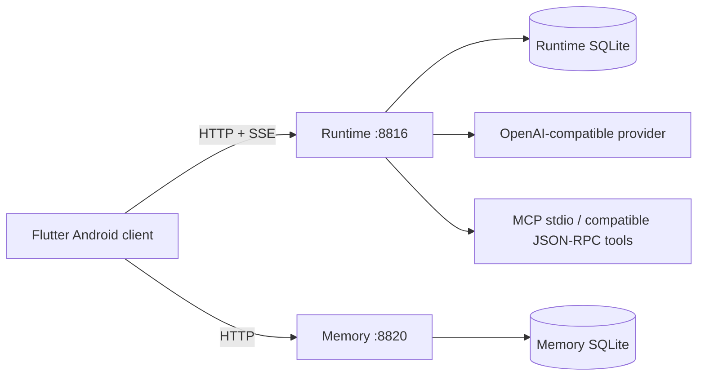

# Continuum Chat

[简体中文](README.md) | **English**

Continuum Chat is a self-hosted Android AI chat reference app built with **Flutter, FastAPI, and SQLite**. It streams OpenAI-compatible responses, keeps canonical conversation history on the server, supports explicit context epochs, manual memory-card recall, manual MCP tool discovery/invocation, and provider usage analytics. It runs locally with a mock provider, so the core flow can be tested without an API key.

<p align="center">
  
</p>

### Core capabilities

- Streaming AI Chat: SSE responses with optional reasoning events
- Server-owned canonical history persisted by Runtime
- Context Epochs that change future provider context without deleting history
- Separate Memory service for CRUD and deterministic recall
- Manual stdio MCP tool discovery/invocation plus a basic JSON-RPC-over-HTTP adapter
- Provider input/output token usage analytics by day

**Stack:** Flutter · FastAPI · SQLite · Python · Dart

[](https://github.com/yuyu1838309000-cmd/continuum-chat/actions/workflows/ci.yml)

[Quick start](#quick-start) · [30-second code tour](#30-second-code-tour) · [Screenshots](#screenshots) · [Architecture](#architecture)

## 30-second code tour

| Concern | Start here |
| --- | --- |
| Runtime API, SSE chat, auth-protected routes | [`server/app.py`](server/app.py) |
| Provider configuration and SSE normalization | [`server/provider.py`](server/provider.py) |
| Canonical history, context epochs, token aggregation | [`server/runtime_store.py`](server/runtime_store.py) |
| MCP stdio lifecycle and optional JSON-RPC-over-HTTP adapter | [`server/mcp_client.py`](server/mcp_client.py) |
| Memory API and persistence | [`memory/app.py`](memory/app.py), [`memory/store.py`](memory/store.py) |
| Deterministic local recall | [`memory/recall.py`](memory/recall.py) |
| Flutter navigation and screens | [`mobile/lib/app.dart`](mobile/lib/app.dart), [`mobile/lib/features/`](mobile/lib/features/) |
| Mobile HTTP/SSE client | [`mobile/lib/services/api_client.dart`](mobile/lib/services/api_client.dart) |
| Privacy gate | [`scripts/privacy_scan.py`](scripts/privacy_scan.py) |

## Architecture



Flutter talks directly to both services. Runtime owns the transcript and provider interaction; Memory owns memory cards and recall. The baseline intentionally does **not** inject Memory results into chat automatically, and MCP invocation is manual rather than automatic model tool execution.

More detail: [Architecture](docs/ARCHITECTURE.md) · [Configuration](docs/CONFIGURATION.md) · [Security](SECURITY.md) · [Privacy](docs/PRIVACY.md)

## Screenshots

These screenshots are generated from deterministic synthetic demo data in the public repository. They contain no real conversations, real Memory data, private server addresses, API keys, or device information. Regenerate them with `scripts/capture_demo_assets.sh`.

<table>
  <tr>
    <td align="center"><strong>Chat</strong><br></td>
    <td align="center"><strong>History</strong><br></td>
  </tr>
  <tr>
    <td align="center"><strong>Memory</strong><br></td>
    <td align="center"><strong>Tools / MCP</strong><br></td>
  </tr>
  <tr>
    <td colspan="2" align="center"><strong>Settings</strong><br></td>
  </tr>
</table>

## Quick start

### Backend-only demo — no API key or Android toolchain

Requirements: **Python 3.10+** and a macOS/Linux Bash shell. (`bootstrap_dev.sh` creates the virtual environment, installs Python dependencies, and creates ignored local configuration files.)

```bash
git clone https://github.com/yuyu1838309000-cmd/continuum-chat.git
cd continuum-chat
./scripts/bootstrap_dev.sh
```

Start Memory:

```bash
.venv/bin/python -m memory.app
```

Start Runtime in another terminal:

```bash
.venv/bin/python -m server.app
```

Then verify the two services and stream a mock response:

```bash
curl http://127.0.0.1:8816/health
curl http://127.0.0.1:8820/health

curl -N \
  -H 'Content-Type: application/json' \
  -d '{"message":"Hello"}' \
  http://127.0.0.1:8816/chat
```

The default provider is `mock://local`. The mock emits deterministic placeholder usage counts; configured HTTP providers store the token usage reported by the provider.

### Android client

CI uses **Flutter 3.44.8**. With Flutter and an Android SDK/emulator installed:

```bash
cd mobile
flutter pub get
flutter run
```

The Android emulator defaults are `http://10.0.2.2:8816` and `http://10.0.2.2:8820`. Connection, provider, token, and MCP settings are editable in the app.

For a physical phone, network binding, bearer-token setup, HTTPS guidance, and the Windows cross-drive Android build note are documented in [Configuration](docs/CONFIGURATION.md) and [Security](SECURITY.md).

## Feature matrix

| Area | Implemented scope |
| --- | --- |
| Streaming chat | SSE from an OpenAI-compatible provider, including optional reasoning events |
| Context management | Runtime API for explicit context-epoch rollover; persisted history remains intact |
| Memory | Manual memory-card CRUD and deterministic lexical recall |
| Provider support | Offline mock provider plus configurable OpenAI-compatible endpoints |
| MCP/tools | Manual stdio MCP discovery/invocation; optional basic JSON-RPC-over-HTTP adapter; no automatic model tool execution |
| Analytics | Daily message totals and provider-reported input/output token usage; mock counts are placeholders |
| Mobile | Flutter Android client with Chat, History, Memory, Tools, and Settings |
| Security | Loopback defaults; bearer token required for non-loopback binding |
| Privacy | Ignored runtime state plus an automated privacy/secret gate |

## Configuration

Copy `config/provider.example.json` to ignored `config/provider.json`, or edit Provider settings in the app. Copy `examples/mcp_config.example.json` to ignored `config/mcp.json` only if you want the disabled local filesystem MCP demo.

MCP stdio entries launch local executables with the Runtime account's permissions and are **not sandboxed** by Continuum Chat. See [Configuration](docs/CONFIGURATION.md) and [Security](SECURITY.md) before enabling them on a network-accessible host.

## Engineering trade-offs

- **SQLite over an external database:** keeps the single-user reference stack inspectable and runnable without infrastructure.
- **Lexical recall over embeddings:** removes an external model/service dependency from the baseline while preserving a clean service boundary for later replacement.
- **Manual MCP invocation:** demonstrates stdio MCP lifecycle, configuration/auth boundaries, and tool calls without pretending the baseline implements an autonomous tool loop.
- **Provider-reported usage:** real HTTP providers persist their own usage metadata rather than estimating tokens from message length.
- **Single-user auth model:** bearer auth plus loopback-safe defaults are appropriate for this reference scope; this is not a multi-tenant identity platform.

## Repository layout

```text
mobile/              Flutter Android client
server/              Runtime, provider adapter, history, MCP
memory/              Memory service and local recall
config/              Safe provider example; real local config is ignored
examples/            Disabled public MCP example
mcp-demo-workspace/  Restricted filesystem-MCP demo directory
scripts/             Bootstrap and privacy checks
docs/                Architecture, configuration, privacy
.github/workflows/   CI
```

## Validation

Local checks:

```bash
python3 -m py_compile server/*.py memory/*.py
python3 -m unittest discover -s . -p 'test_*.py'
python3 scripts/privacy_scan.py
git diff --check
cd mobile
dart format --output=none --set-exit-if-changed lib test tool
flutter analyze
flutter test
flutter test tool/demo_screenshots_test.dart
cd ..
python3 scripts/check_demo_assets.py
cd mobile
flutter build apk --debug
```

CI runs Python compile/tests/privacy scanning, Dart formatting, Flutter analysis/tests, and a debug APK build. `git diff --check` remains a local contributor check.

Runtime databases, transcripts, memory data, logs, generated local configs, builds, signing material, and environment files are excluded from version control. See [Privacy](docs/PRIVACY.md) for the release gate.

## Scope

Continuum Chat is intentionally a **single-user, self-hosted reference application**. It does not claim multi-user authorization, internet-grade abuse controls, autonomous tool execution, semantic memory retrieval, or deployment automation.

## License

MIT.
