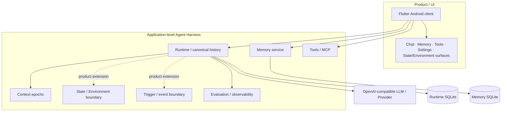
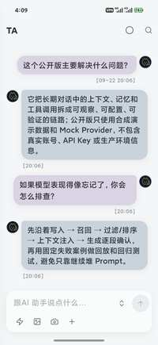
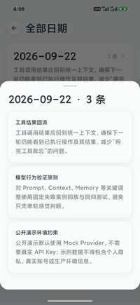

# Continuum Chat

[简体中文](README.md) | **English**

Continuum Chat is an application-level **LLM Agent Harness** portfolio project for **long-running personal agents**, built with **Flutter, FastAPI, and SQLite**. The focus is not model training; it is the system around the model: how Context, Memory, State / Environment, Tools, Trigger, Runtime, and evaluation fit together so an agent can remain coherent over long-term use.

The public repository is **not the complete production backend** of the source product. It is a sanitized, runnable, reviewable reference slice: the mobile tree preserves the real product UI and interaction architecture, while the included Runtime, Memory, MCP, and Provider layers expose a compact reference backend. A local mock provider lets the core flow run without an API key. For safety and reproducibility, the public baseline intentionally narrows autonomous behavior: Memory is not injected into chat automatically, MCP calls are manual, and advanced State / Environment and Trigger paths are represented as product-level boundaries or extension points rather than claimed as fully implemented public backend behavior.

### Core capabilities

- **Runtime / Context:** server-owned canonical history with Context Epochs controlling future provider-visible context
- **Memory boundary:** independent Memory CRUD / recall service with a replaceable retrieval strategy
- **State / Environment boundary:** preserved product surfaces and event/state integration points; no full public environment engine
- **Tools / MCP:** manual stdio discovery/invocation plus a basic JSON-RPC-over-HTTP adapter
- **Provider layer:** OpenAI-compatible provider adapter, SSE normalization, and token-usage persistence
- **Evaluation / observability:** local tests, privacy scanning, usage analytics, and deterministic mock flows
- **Sanitized product UI:** chat/reasoning/tool presentation, history, Memory, context/settings, model/provider, MCP/plugins/tools, calendar/diary, and other content surfaces

**Stack:** Flutter · FastAPI · SQLite · Python · Dart

[](https://github.com/yuyu1838309000-cmd/continuum-chat/actions/workflows/ci.yml)

[Quick start](#quick-start) · [30-second code tour](#30-second-code-tour) · [Product preview](#product-preview) · [Architecture](#architecture)

## 30-second code tour

| Concern | Start here |
| --- | --- |
| Runtime API, SSE chat, auth-protected routes | [`server/app.py`](server/app.py) |
| Provider configuration and SSE normalization | [`server/provider.py`](server/provider.py) |
| Canonical history, context epochs, token aggregation | [`server/runtime_store.py`](server/runtime_store.py) |
| MCP stdio lifecycle and optional JSON-RPC-over-HTTP adapter | [`server/mcp_client.py`](server/mcp_client.py) |
| Memory API and persistence | [`memory/app.py`](memory/app.py), [`memory/store.py`](memory/store.py) |
| Deterministic local recall | [`memory/recall.py`](memory/recall.py) |
| Flutter app entry and navigation root | [`mobile/lib/main.dart`](mobile/lib/main.dart), [`mobile/lib/pages/`](mobile/lib/pages/) |
| Chat/runtime, history, Memory, and server configuration clients | [`mobile/lib/services/chat_api.dart`](mobile/lib/services/chat_api.dart), [`mobile/lib/services/runtime_history_api.dart`](mobile/lib/services/runtime_history_api.dart), [`mobile/lib/services/memory_api.dart`](mobile/lib/services/memory_api.dart), [`mobile/lib/services/server_config.dart`](mobile/lib/services/server_config.dart) |
| Privacy gate | [`scripts/privacy_scan.py`](scripts/privacy_scan.py) |

## Architecture

From a product perspective, Continuum Chat separates three layers: **Product / UI → Agent Harness → LLM / Provider**. The public repository preserves the product layer and exposes the subset of the harness that can be published safely and reproduced locally.



In the public baseline, Runtime owns the canonical transcript, Context Epochs, provider interaction, and usage; Memory owns memory cards and deterministic recall; MCP invocation is manual. State / Environment and Trigger are shown as architectural boundaries and extension points. **This does not claim that the public backend already implements a complete autonomous agent loop.**

More detail: [Architecture](docs/ARCHITECTURE.md) · [Configuration](docs/CONFIGURATION.md) · [Security](SECURITY.md) · [Privacy](docs/PRIVACY.md)

## What this project is / is not

**It is:**

- an application-level harness / runtime portfolio for long-running personal agents
- an engineering organization of Context, Memory, Tools, State / Environment, Runtime, and related model-external capabilities
- an AI application project centered on reproducing real failures, choosing trade-offs, and validating fixes

**It is not:**

- a foundation-model training project
- a low-level Embedding / RAG algorithm research project
- a Multi-Agent Framework; the main design is still one core agent with multiple capability boundaries
- a fully open production autonomous-agent backend
- a demonstration of an embedded Coding Agent sub-agent; Codex and similar Coding Agents are primarily used to develop this project

## Sanitized iteration evidence

The following numbers come from long-running iteration on the source product and are included to show problem scale and validation practice. The public repository keeps only a safe reference subset and does not claim that every result is directly reproducible from the minimal baseline.

- rebuilt **99 historical conversation windows** for long-term memory migration and recall validation
- **148 model / Prompt / Context replay results** across three evaluation rounds
- person-reference recall-threshold regression: **15/15 PASS**
- proactive trigger-policy regression: **96/96 PASS**
- identified roughly **34%–39%** extra duplicated history in selected real branches
- Runtime migration covered **35 conversation windows and 4,907 historical messages**

## Product preview

<p align="center">
  
</p>

<p align="center">
  
</p>

Both screenshots come from the sanitized Android demo and use synthetic demo data only; they contain no private conversations, real Memory, server addresses, API keys, or device identity information.

## Quick start

### Backend-only demo — no API key or Android toolchain

Requirements: **Python 3.10+** and a macOS/Linux Bash shell. (`bootstrap_dev.sh` creates the virtual environment, installs Python dependencies, and creates ignored local configuration files.)

```bash
git clone https://github.com/yuyu1838309000-cmd/continuum-chat.git
cd continuum-chat
./scripts/bootstrap_dev.sh
```

Start Memory:

```bash
.venv/bin/python -m memory.app
```

Start Runtime in another terminal:

```bash
.venv/bin/python -m server.app
```

Then verify the two services and stream a mock response:

```bash
curl http://127.0.0.1:8816/health
curl http://127.0.0.1:8820/health

curl -N \
  -H 'Content-Type: application/json' \
  -d '{"message":"Hello"}' \
  http://127.0.0.1:8816/chat
```

The default provider is `mock://local`. The mock emits deterministic placeholder usage counts; configured HTTP providers store the token usage reported by the provider.

### Android client

CI uses **Flutter 3.44.8**. With Flutter and an Android SDK/emulator installed:

```bash
cd mobile
flutter pub get
flutter run
```

`ServerConfig` defaults to host `127.0.0.1`; Runtime uses port `8816` and Memory uses `8820`. When the backend runs on the development host, Android Emulator users generally need to change the host to `10.0.2.2`. Physical-device users can keep `127.0.0.1` with `adb reverse`, or configure a host reachable from the device.

The sanitized client has no hardcoded server credential. Its optional server token is supplied at build time with `--dart-define=CONTINUUM_SERVER_TOKEN=...`. See [Configuration](docs/CONFIGURATION.md) for the public backend's separate bearer-auth configuration and compatibility scope.

For a physical phone, network binding, bearer-token setup, HTTPS guidance, and the Windows cross-drive Android build note are documented in [Configuration](docs/CONFIGURATION.md) and [Security](SECURITY.md).

## Feature matrix

| Area | Implemented scope |
| --- | --- |
| Streaming chat | SSE from an OpenAI-compatible provider, including optional reasoning events |
| Context management | Runtime API for explicit context-epoch rollover; persisted history remains intact |
| Memory | Manual memory-card CRUD and deterministic lexical recall |
| State / Environment | Persistent-state/environment interaction boundaries are preserved in the product architecture; the minimal public backend does not include a full environment engine |
| Trigger / proactive | Represented as a source-product architectural boundary; the public baseline does not implement an automatic trigger loop |
| Provider support | Offline mock provider plus configurable OpenAI-compatible endpoints |
| MCP/tools | Manual stdio MCP discovery/invocation; optional basic JSON-RPC-over-HTTP adapter; no automatic model tool execution |
| Analytics | Daily message totals and provider-reported input/output token usage; mock counts are placeholders |
| Mobile | Sanitized full Flutter frontend preserving chat/reasoning/tool presentation, history, Memory, context/settings, model/provider, MCP/plugin/tool, calendar/diary, and other content surfaces; advanced surfaces may require services beyond the reference backend |
| Security | Loopback defaults; bearer token required for non-loopback binding |
| Privacy | Ignored runtime state plus an automated privacy/secret gate |

## Configuration

Copy `config/provider.example.json` to ignored `config/provider.json`, or edit Provider settings in the app. Copy `examples/mcp_config.example.json` to ignored `config/mcp.json` only if you want the disabled local filesystem MCP demo.

MCP stdio entries launch local executables with the Runtime account's permissions and are **not sandboxed** by Continuum Chat. See [Configuration](docs/CONFIGURATION.md) and [Security](SECURITY.md) before enabling them on a network-accessible host.

## Engineering trade-offs

- **SQLite over an external database:** keeps the single-user reference stack inspectable and runnable without infrastructure.
- **Lexical recall over embeddings:** removes an external model/service dependency from the baseline while preserving a clean service boundary for later replacement.
- **Manual MCP invocation:** demonstrates stdio MCP lifecycle, configuration/auth boundaries, and tool calls without pretending the baseline implements an autonomous tool loop.
- **Provider-reported usage:** real HTTP providers persist their own usage metadata rather than estimating tokens from message length.
- **Single-user auth model:** bearer auth plus loopback-safe defaults are appropriate for this reference scope; this is not a multi-tenant identity platform.

## Repository layout

```text
mobile/              Sanitized full Flutter frontend (models, pages, services, utilities, widgets)
server/              Runtime, provider adapter, history, MCP
memory/              Memory service and local recall
config/              Safe provider example; real local config is ignored
examples/            Disabled public MCP example
mcp-demo-workspace/  Restricted filesystem-MCP demo directory
scripts/             Bootstrap and privacy checks
docs/                Architecture, configuration, privacy
.github/workflows/   CI
```

## Validation

Local checks:

```bash
python3 -m py_compile server/*.py memory/*.py
python3 -m unittest discover -s . -p 'test_*.py'
python3 scripts/privacy_scan.py
git diff --check
cd mobile
dart format --output=none --set-exit-if-changed lib test
flutter analyze
flutter test
flutter build apk --debug
```

CI runs Python compile/tests/privacy scanning, Dart formatting, Flutter analysis/tests, and a debug APK build. `git diff --check` remains a local contributor check.

Runtime databases, transcripts, memory data, logs, generated local configs, builds, signing material, and environment files are excluded from version control. See [Privacy](docs/PRIVACY.md) for the release gate.

## Scope

Continuum Chat is intentionally a **single-user, self-hosted Agent Harness reference implementation and portfolio slice**. It focuses on model-external system boundaries and engineering trade-offs for long-running agents; the public baseline does not claim multi-user authorization, internet-grade abuse controls, autonomous tool execution, a complete State / Environment engine, an automatic Trigger loop, semantic memory retrieval, or deployment automation.

## License

MIT.
