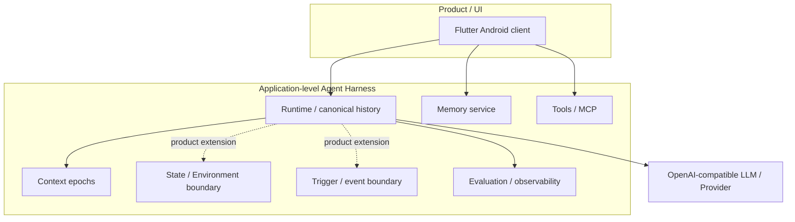

# Architecture

Continuum Chat is organized as an application-level **LLM Agent Harness** for long-running personal-agent use cases. The public repository exposes a sanitized, runnable subset of that architecture: a preserved Flutter product frontend, a Runtime reference service, and a Memory reference service. The goal of this document is to distinguish the broader product architecture from the smaller public backend so the repository can show the real system boundaries without overstating what the open baseline implements.

## Conceptual model

The product architecture is easiest to read in three layers:

1. **Product / UI** — the human-facing chat, Memory, tool, settings, state/environment, calendar/diary, and other interaction surfaces.
2. **Agent Harness** — model-external runtime concerns such as Context/history, Memory, State / Environment, Tools/MCP, Trigger/event handling, provider routing, and evaluation/observability.
3. **LLM / Provider** — the model endpoint used for reasoning and generation.

Solid paths correspond to the runnable public reference flow. Dashed `product extension` paths mark boundaries that exist in the broader product architecture but are intentionally not presented as complete autonomous behavior in the public backend.

## Ownership

| Component | Responsibility | Owned state | Entry point |
| --- | --- | --- | --- |
| Flutter Android client | Product UI/interaction architecture across chat, reasoning/tool presentation, history, Memory, context/settings, model/provider, plugins/tools, calendar/diary, and content views | Device-local preferences and UI state | [`mobile/lib/main.dart`](../mobile/lib/main.dart), [`mobile/lib/pages/`](../mobile/lib/pages/) |
| Runtime | Chat API, provider streaming, canonical history, context epochs, usage aggregation, MCP transport | Runtime SQLite + ignored provider/MCP config | [`server/app.py`](../server/app.py) |
| Runtime SQLite | Conversations, epochs, messages, provider usage metadata | Canonical transcript/history | [`server/runtime_store.py`](../server/runtime_store.py) |
| Memory | Memory-card CRUD and deterministic lexical recall | Memory SQLite | [`memory/app.py`](../memory/app.py) |
| Memory SQLite | Memory cards and tags | Memory data | [`memory/store.py`](../memory/store.py) |

Memory is deliberately separate from Runtime so its persistence and retrieval strategy can evolve without changing the transcript contract or mobile memory CRUD API.

## Public integration scope

The included Runtime and Memory services implement the core runnable reference subset described below. The preserved frontend is intentionally broader: some screens call compatible product endpoints or supporting services that are not included in the minimal public backend. Their presence documents the real frontend architecture, not a claim that every surface works end to end with these two services.

## Runtime flow

1. Flutter posts a user message to `/chat`.
2. Runtime persists it and loads the active context epoch.
3. Runtime sends that epoch's provider-visible messages to the configured provider.
4. Provider streaming is normalized into text, reasoning, tool, and usage events.
5. Runtime persists the canonical assistant message plus provider usage, then emits its own `done` SSE event.
6. History and calendar analytics are read back from Runtime SQLite.

Context rollover creates a new epoch for future provider context without deleting older persisted messages.

## Memory boundary

Memory cards are independent from the transcript. The baseline uses deterministic lexical overlap ranking so it can run without an embedding service.

The Flutter client talks directly to Memory for CRUD and recall. **Runtime does not automatically recall or inject Memory cards into chat.** The service boundary makes an embedding/reranking adapter possible later without changing the public mobile contract.

## MCP boundary

Runtime implements the MCP lifecycle over stdio. Tools are listed and invoked manually from the Flutter Tools screen; the baseline does **not** implement an automatic model tool-execution loop.

A separate `http` mode posts JSON-RPC payloads directly to a configured endpoint. It is a simple compatibility adapter, **not** a full MCP Streamable HTTP transport: it does not implement MCP HTTP session negotiation or SSE response handling. Use it only with endpoints that explicitly support that simpler contract.

The shipped filesystem example uses stdio, is disabled by default, and restricts access to a repository-local demo directory. MCP configuration is administrative because stdio entries name executables.

## State / Environment boundary

In the broader product architecture, persistent state and environment information are separate from long-term Memory. Memory answers questions such as “what happened before?” while State / Environment represents “what is true now?” or “what changed in the current world/session.” The preserved Flutter product tree contains event- and state-oriented interaction surfaces and clients, but the minimal public Python backend does **not** claim to ship the full persistent environment engine from the source product.

This distinction matters because an agent can retrieve old facts correctly and still behave incoherently if its current state, environment, or previous action result is missing from the next turn.

## Trigger / proactive-behavior boundary

The source product architecture also contains event/trigger concepts for deciding when an agent should act. The public reference backend intentionally leaves this as an extension boundary: it does not run an autonomous trigger loop, schedule agent behavior, or automatically decide to invoke tools. This keeps the public baseline deterministic and avoids presenting a reduced demo as a complete production agent scheduler.

## Action-result continuity

A complete agent action loop requires the result of an action to return to the runtime state used by the next decision. In other words: **decide → act → observe the result → update state/context → decide again**. The public MCP baseline demonstrates transport and manual invocation boundaries, while automatic action-result continuation remains outside the minimal reference scope.

## Evaluation and observability

The harness is treated as a system that must be measured, not only prompted. The public repository includes deterministic mock flows, unit tests, CI, provider-usage persistence, and privacy scanning. The source project additionally used replay/regression sets to validate long-running behavior changes. Those source-project metrics are summarized in the README and are clearly labeled as sanitized iteration evidence rather than public-baseline benchmark claims.

## Scope terminology

- **Agent** refers to the behaviorally coherent system using an LLM plus model-external state, tools, and execution rules; it is not synonymous with the model endpoint itself.
- **Harness** refers to the application/runtime system around the model. It is an engineering boundary, not a claim that every listed capability is fully implemented by the public backend.
- Continuum Chat is **not a Multi-Agent Framework** in its current public positioning. The primary design is one core agent with multiple capability boundaries.
- Coding Agents such as Codex are used for development collaboration; they are not presented here as built-in runtime sub-agents.

## Trade-offs

- **Single-user scope:** shared bearer authentication is intentionally smaller than a multi-tenant identity/authorization system.
- **SQLite:** favors inspectability and low setup cost over horizontal scaling.
- **Lexical memory recall:** favors deterministic offline behavior over semantic recall quality.
- **Manual MCP invocation:** exposes the stdio MCP lifecycle and security boundaries without hiding them inside an autonomous loop.
- **Separate Memory service:** adds one local process but keeps memory strategy replaceable and transcript ownership clear.

## Security boundary

Only health checks are intentionally public. Runtime data/chat/config/history/MCP endpoints and Memory data endpoints enforce the configured bearer token.

Both services default to loopback and reject non-loopback startup when the token is empty. CORS has no wildcard default. TLS, user accounts, rate limiting, multi-user authorization, and internet-grade abuse controls are outside this single-user reference scope.

See [Security](../SECURITY.md) and [Configuration](CONFIGURATION.md).
